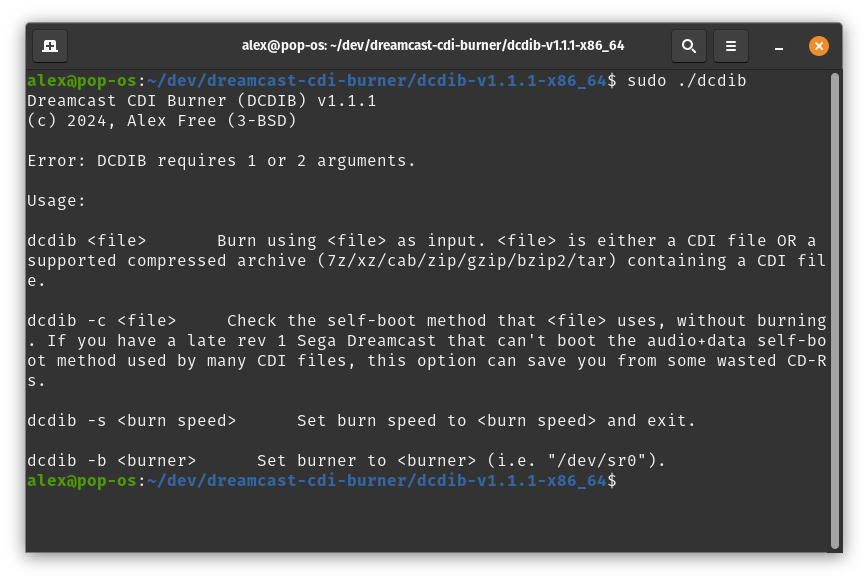
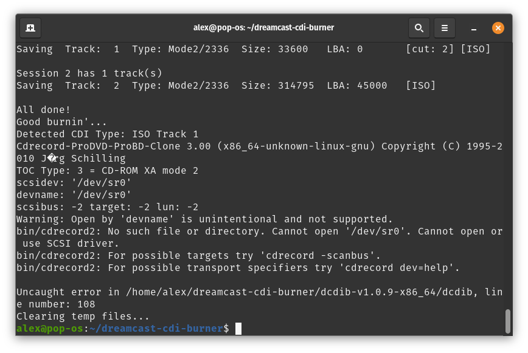

# Dreamcast CDI Burner (DCDIB) : Burn ALL Sega Dreamcast .CDI Files On Linux With Open Source Software

_by Alex Free_

 DCDIB is an open source toolkit for burning Sega Dreamcast `.cdi` files (used for self-booting homebrew programs and backups) to CD-R discs on Linux! CDI is the proprietary format of the Windows only software DiscJuggler. CDI is a very popular format for Sega Dreamcast software distribution. The CD-Rs you burn with DCDIB will _just work_ and boot like authentic Sega Dreamcast GD-ROM discs on revision 0 and revision 1 Sega Dreamcast consoles. **Revision 2 Sega Dreamcast consoles may or may not work with self-booting CD-Rs** due to the MIL-CD exploit being removed from the BIOS chip found on at least some revision 2 consoles. To find out what revision your Sega Dreamcast console is, flip the entire console upside-down and look for the number 0, 1, or 2 in a circle on the model sticker as displayed below:

DCDIB supports burning **all 4 Sega Dreamcast CDI file format types**:

*   Data ISO (Session 1) + Data ISO (Session 2)
*   WAV/audio track (Session 1) + Data ISO (Session 2)
*   Multiple CDDA WAVs/audio tracks (Session 1) + Data ISO (Session 2)
*   Multiple CDDA WAVs/audio tracks in an ISO (Session 1) + Data ISO (Session 2)

## Links

*   [GitHub](https://github.com/alex-free/dreamcast-cdi-burner)
*   [Homepage](https://alex-free.github.io/dcdib)
*   [Dreamcast-Talk Thread](https://www.dreamcast-talk.com/forum/viewtopic.php?f=2&t=13974)

## Table Of Contents

*   [Downloads](#downloads)
*   [CD-R Media](#cd-r-media)
*   [Usage](#usage)
*   [Building From Source](build.md)
*   [License](#license)

## Downloads

### v1.1.0 (5/24/2024)

*   [DCDIB v1.1.0](https://github.com/alex-free/dreamcast-cdi-burner/releases/download/v1.1.0/dcdib-v1.1.0-x86_64.zip) _Portable Release For x86\_64 Linux_.

Changes:

*   Updated CDRTools/CDRecord to the last official version by the original author, [version 3.02a9](https://github.com/alex-free/cdrtools).

*   Fixed a bug where data type CDI files were not closed in the 2nd session during the final burn.

[About previous versions](changelog.md).

## CD-R Media

It is recommend to only use high-quality CD-R media with a Good CD-R Burner. My [Ultimate Guide To PSX CD-Rs](https://alex-free.github.io/psx-cdr) has a ton of info with that is also useful for Dreamcast in regards to good CD-R media and burners. The only thing specific to PSX is recommending 71 or 74 minute CD-Rs. While some CDI files can fit on lower capacity CD-Rs (i.e. 74 minutes), most CDI files target 80 minute CD-Rs. For CDI files targeting CD-R capacities larger then 80 minutes, such as 99 or 100 minute CD-Rs, be aware that not all 99 or 100 minute CD-Rs are compatible with the Dreamcast, and some burners don't even support writing that much data to a disc as it is way out of Red Book spec. Some specific brands/types of 99 and 100 minute CD-Rs DO however work, though I don't have any tests done myself yet.

If you are still having issues booting even high quality CD-Rs on the Sega Dreamcast, consider wiping with a clean microfiber cloth from the inner ring to the outer edge of the CD-R in all directions and then trying to boot the disc again.

# Usage

1) Download and unzip the latest release.

2) After inserting a high-quality CD-R disc in your CD-R burner, **ignore any prompts about the new blank CD-R** that your OS may display such as:

3) **Using sudo execute the `dcdib` script in the extracted release directory with 1 or 2 arguments**. Root privileges are required to ensure that buffer under-runs do not occur during burning which would result in a CD-R coaster. Root privileges also ensure that `cdrecord` can access your CD burner hardware successfully to burn the CD-R.

The first argument is the filepath to either a CDI file OR a supported compressed archive (7z/xz/cab/zip/gzip/bzip2/tar) containing a CDI file.

The second argument is completely optional, it allows you to change the CD burner's device devname to a custom one. DCDIB already provides a default CD burner device devname to use which should work on most if not all Linux distributions (`/dev/sr0`). However if you find this to not work on your setup you can provide your own in the optional second argument to DCDIB. You will know if you need to specify this argument because something like below will be displayed:

## License

DCDIB itself is released into the public domain, see the file `dcdib.md` in the `licenses` directory.

DCDIB makes use of the following programs listed below, which have their own licenses/terms:

*   [PortableLinuxExecutableDirectory](https://alex-free.github.io/pled) (Public Domain, see the file `licenses/pled.txt`).

*   [CDIRip](https://github.com/jozip/cdirip) (GNU GPL v2, see the file `licenses/cdirip.txt`).

*   [CDRRecord (from CDRTools)](https://Distrotech/cdrtools) (CDDL v1.0 AND GPL v2, see the files `licenses/cdrecord-cddl.txt` and `licenses/cdrecord-gpl2.txt`).

*   [P7zip-zstd](https://github.com/p7zip-project/p7zip) (GNU LGPL with unRAR license restriction, BSD-3 Clause, and Public Domain), see `licenses/p7zip.txt`.